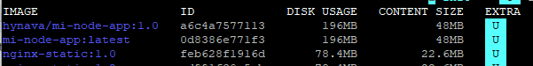
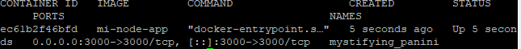
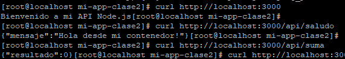
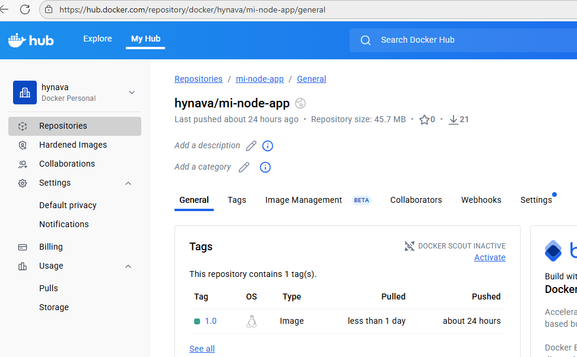

# Clase 2 - Dockerización de Mi Aplicación

## Aplicación

**Lenguaje:** Node.js
**Framework:** Express
**Descripción:** API REST para gestión de tareas

**Endpoints:**
- GET / - Página de bienvenida
- GET /api/saludo - Hola
- POST /api/suma - sumar numeros

## Dockerfile

\`\`\`dockerfile
# Etapa 1: build
FROM node:18-alpine AS build
WORKDIR /app
COPY package*.json ./
RUN npm install
COPY . .

# Etapa 2: producción
FROM node:18-alpine AS production
WORKDIR /app
...
\`\`\`

**Explicación:**

| Etapa | Propósito |
|-------|-----------|
| Build | Instalar todas las dependencias... |
| Produccion | Solo runtime... |

## Build

\`\`\`bash
docker build -t mi-node-app .
\`\`\`

**Salida:**
\`\`\`
[+] Building 2.1s (15/15) FINISHED
Successfully tagged tasks-api:1.0
\`\`\`

**Tamaño final:** 45.7MB

## Testing

## Docker Hub

**URL:** https://hub.docker.com/repository/docker/hynava/mi-node-app/general

## Optimizaciones

- Multi-stage build
- Usuario non-root

## Conclusiones

Aprendí a hacer build de imágenes y subir a docker hub...
